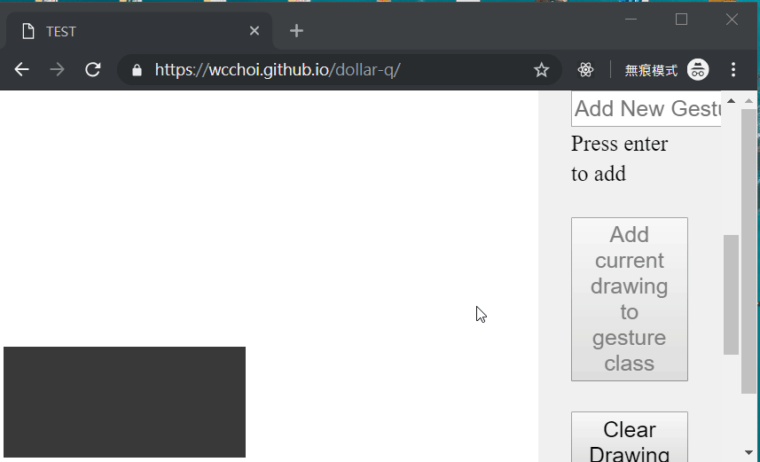

# $Q Gesture Recognizer in JS

Implementation of [$Q Super-Quick Recognizer](http://depts.washington.edu/madlab/proj/dollar/qdollar.html) in JavaScript

    

$Q is an improved, faster version of [$P Point-Cloud Recognizer](https://depts.washington.edu/madlab/proj/dollar/pdollar.html), which is a gesture recognition algorithm that allow:

- users to draw the gesture in how many strokes they want/natural to them
- draw the stroke in any order, direction
- scale-invariant (recognition not affected by how large/small the user draw the gesture)
- easy to implement and understand
- accurate enough (provided that sufficient gesture templates (i.e. training data) are given)

There are two sample data sets - Greek alphabet and Cangjie (a set of Chinese characters) - provided for testing, note that accuracy is likely to be low because there is only one template for each gesture class and they are drawn by me (i.e. reflect my own writing style).

In my experience, the algorithm seems to work better for simple shape/symbol-based gestures, less so for alphabet/character type.

## Credit:

Some codes are directly adopted from the following projects:

- https://github.com/francoislaberge/outlines
- https://github.com/cluelab/dollar-recognizers-java/blob/master/src/main/java/com/github/cluelab/dollar/QPointCloudRecognizer.java
